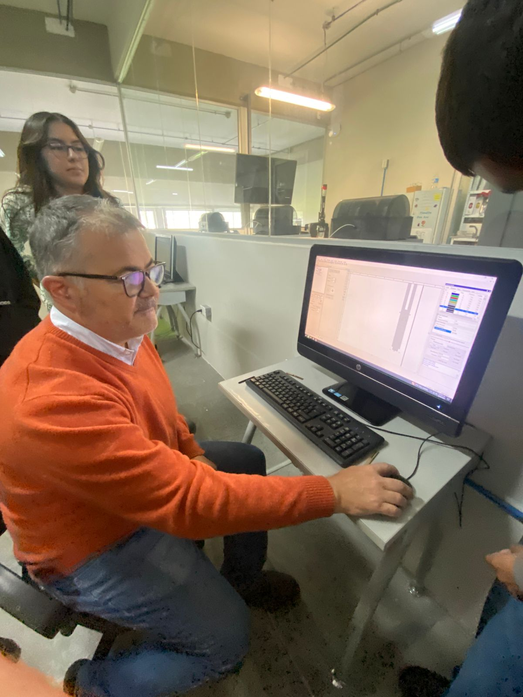
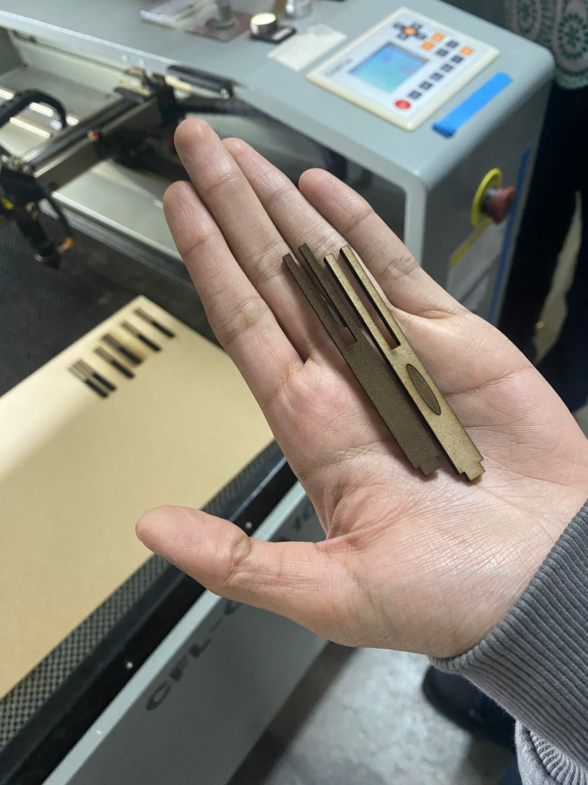

# Trabajo semanal
---
### Semana 2 (29/05/25)

[Syllabus][doc-ref]

[doc-ref]: https://github.com/user-attachments/files/22192666/ScanSyllabusProyectoIngenieria.pdf "Practica 1"

### Tarea 1

 

[Enlace directo](https://iberopuebla-my.sharepoint.com/:u:/g/personal/203599_iberopuebla_mx/Eb8R9IEmgOlIoTJIxipH2QUBdf1OQik5LTwOIDPUnIOe_w?e=Bknjgt)

### Ejercicio 3

 

[Enlace directo](https://iberopuebla-my.sharepoint.com/:u:/g/personal/203599_iberopuebla_mx/EZqiuaQncBZAqdMaiTxne-sBO_lrMAziB6y18CshPJj4rg?e=t0laoq)

### Ejercicio 5

 

[Enlace directo](https://iberopuebla-my.sharepoint.com/:u:/g/personal/203599_iberopuebla_mx/EbFFcYND34pPuvw7OiX5H0YBzlhFvyqvbEXo9-txtcCt2g?e=iEIuX6)

### Florero

 

[Enlace directo](https://iberopuebla-my.sharepoint.com/:u:/g/personal/203599_iberopuebla_mx/EZ1rLMzmvQpFmjqNYbOqnRgBzRmKy9k86GRMSvnz9RX0eA?e=BKbNcp)

### Maceta 1

 

[Enlace directo](https://iberopuebla-my.sharepoint.com/:u:/g/personal/203599_iberopuebla_mx/ERqRGA3o2o9IsSqqOnfIw7gBV0Ob4TD_jhZCrPU3JgEKGA?e=MjuNGp) 

### Maceta 2

 

[Enlace directo](https://iberopuebla-my.sharepoint.com/:u:/g/personal/203599_iberopuebla_mx/ESXg-GAfJgxEuvUuhufZMe4BfDe-Wp3OSsLXohviJ1W6AQ?e=CKRxE3)

### Maceta 3

 

[Enlace directo](https://iberopuebla-my.sharepoint.com/:u:/g/personal/203599_iberopuebla_mx/ES-6ij2070FLnzlO6EpYd8kBfsAaLL8qrRlJpNHIkPerxA?e=QBEB7B)

### Ida al IDIT

 

### Portacelulares

 

### Introducción al corte laser

### Ensamble de corte laser

### Grabado de logo con laser 

### Impresión 3D

### Impresión 3D con IA

