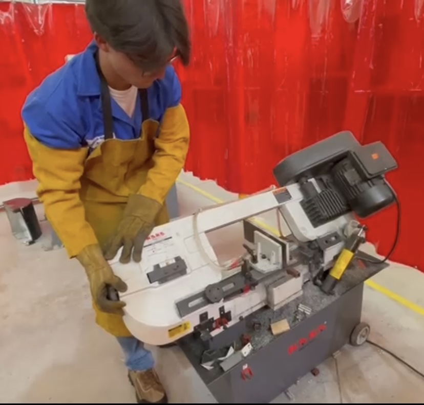

<!DOCTYPE html>
<html lang="es">
<head>
    <meta charset="UTF-8">
    <meta name="viewport" content="width=device-width, initial-scale=1.0">
    <title>Portafolio de Proyectos</title>
    
</head>
<body>
    

        

            <h1>Portafolio de Proyectos</h1>
            
Ingeniería y Fabricación Digital - Semana 2

        

        

            <button class="tab active" onclick="openTab(event, 'solidworks')">SolidWorks</button>
            <button class="tab" onclick="openTab(event, 'idit')">Visita IDIT</button>
            <button class="tab" onclick="openTab(event, 'laser')">Corte Láser</button>
            <button class="tab" onclick="openTab(event, 'impresion3d')">Impresión 3D</button>
            <button class="tab" onclick="openTab(event, 'metal')">Corte de Lámina</button>
            <button class="tab" onclick="openTab(event, 'escaneo')">Escaneo 3D</button>
        

        

            <!-- SolidWorks Tab -->
            

                

                    <h3>Syllabus del Curso</h3>
                    
                    <a href="https://github.com/user-attachments/files/22192666/ScanSyllabusProyectoIngenieria.pdf" class="btn-link" target="_blank">Ver Syllabus</a>
                

                

                    <h3>Tarea 1</h3>
                    SolidWorks
                    
                    <a href="https://iberopuebla-my.sharepoint.com/:u:/g/personal/203599_iberopuebla_mx/Eb8R9IEmgOlIoTJIxipH2QUBdf1OQik5LTwOIDPUnIOe_w?e=Bknjgt" class="btn-link" target="_blank">Ver Archivo</a>
                

                

                    <h3>Ejercicio 3</h3>
                    SolidWorks
                    
                    <a href="https://iberopuebla-my.sharepoint.com/:u:/g/personal/203599_iberopuebla_mx/EZqiuaQncBZAqdMaiTxne-sBO_lrMAziB6y18CshPJj4rg?e=t0laoq" class="btn-link" target="_blank">Ver Archivo</a>
                

                

                    <h3>Ejercicio 5</h3>
                    SolidWorks
                    
                    <a href="https://iberopuebla-my.sharepoint.com/:u:/g/personal/203599_iberopuebla_mx/EbFFcYND34pPuvw7OiX5H0YBzlhFvyqvbEXo9-txtcCt2g?e=iEIuX6" class="btn-link" target="_blank">Ver Archivo</a>
                

                

                    <h3>Florero</h3>
                    Diseño
                    
                    <a href="https://iberopuebla-my.sharepoint.com/:u:/g/personal/203599_iberopuebla_mx/EZ1rLMzmvQpFmjqNYbOqnRgBzRmKy9k86GRMSvnz9RX0eA?e=BKbNcp" class="btn-link" target="_blank">Ver Archivo</a>
                

                

                    <h3>Macetas</h3>
                    Diseño
                    

                        
                        
                        
                    

                    <a href="https://iberopuebla-my.sharepoint.com/:u:/g/personal/203599_iberopuebla_mx/ERqRGA3o2o9IsSqqOnfIw7gBV0Ob4TD_jhZCrPU3JgEKGA?e=MjuNGp" class="btn-link" target="_blank">Maceta 1</a>
                    <a href="https://iberopuebla-my.sharepoint.com/:u:/g/personal/203599_iberopuebla_mx/ESXg-GAfJgxEuvUuhufZMe4BfDe-Wp3OSsLXohviJ1W6AQ?e=CKRxE3" class="btn-link" target="_blank">Maceta 2</a>
                    <a href="https://iberopuebla-my.sharepoint.com/:u:/g/personal/203599_iberopuebla_mx/ES-6ij2070FLnzlO6EpYd8kBfsAaLL8qrRlJpNHIkPerxA?e=QBEB7B" class="btn-link" target="_blank">Maceta 3</a>
                

            

            <!-- IDIT Tab -->
            

                

                    <h3>Visita al IDIT</h3>
                    Experiencia
                    
Recorrido por las instalaciones del Instituto de Innovación y Desarrollo Tecnológico

                    

                        
                        
                        
                    

                

                

                    <h3>Portacelulares</h3>
                    Proyecto
                    
                

            

            <!-- Laser Tab -->
            

                

                    <h3>Introducción al Corte Láser</h3>
                    Capacitación
                    

                        
                        
                        
                    

                

                

                    <h3>Ensamble de Corte Láser - Pájaro</h3>
                    Fabricación
                    

                        
                        
                    

                    <a href="recursos/archivos/PajaroEnsambleSolid.SLDPRT" class="btn-link" download>Descargar SLDPRT</a>
                    <a href="recursos/archivos/PajaroEnsambleSolid.DXF" class="btn-link" download>Descargar DXF</a>
                

                

                    <h3>Grabado de Logo con Láser</h3>
                    Grabado
                    
                    <a href="recursos/archivos/logodeplayboy.DXF" class="btn-link" download>Descargar DXF</a>
                

            

            <!-- Impresión 3D Tab -->
            

                

                    <h3>Impresión 3D - Esfera</h3>
                    3D Print
                    
                    <a href="recursos/archivos/Solidpiezabna3d.SLDPRT" class="btn-link" download>Descargar Pieza 3D</a>
                

                

                    <h3>Impresión 3D con IA - Perro Salchicha</h3>
                    IA3D Print
                    
                    
Modelo generado con inteligencia artificial e impreso en 3D

                

            

            <!-- Metal Tab -->
            

                

                    <h3>Introducción al Corte de Lámina</h3>
                    Metales
                    

                        
                        
                        
                    

                

            

            <!-- Escaneo Tab -->
            

                

                    <h3>Escaneo 3D de Rostro</h3>
                    Escaneo 3D
                    
Proceso de captura y digitalización de rostro en 3D

                    

                        
                        
                    

                

            

        

    

    
</body>
</html>
